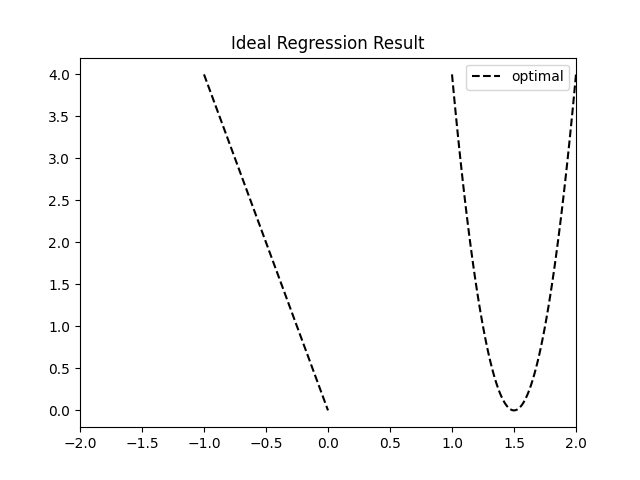
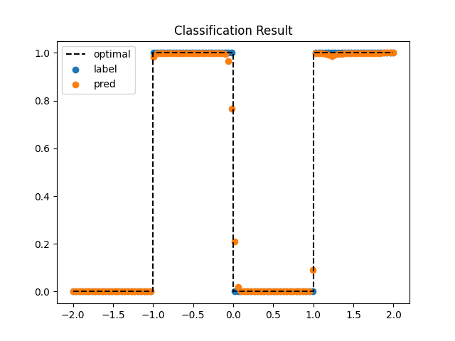
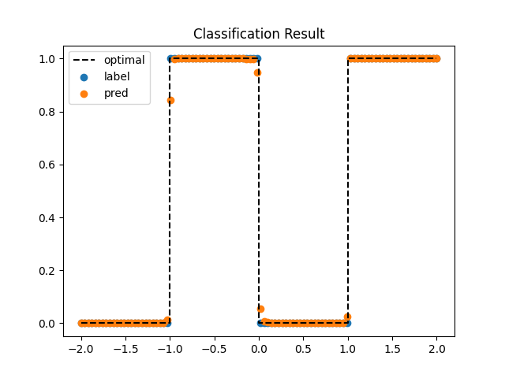
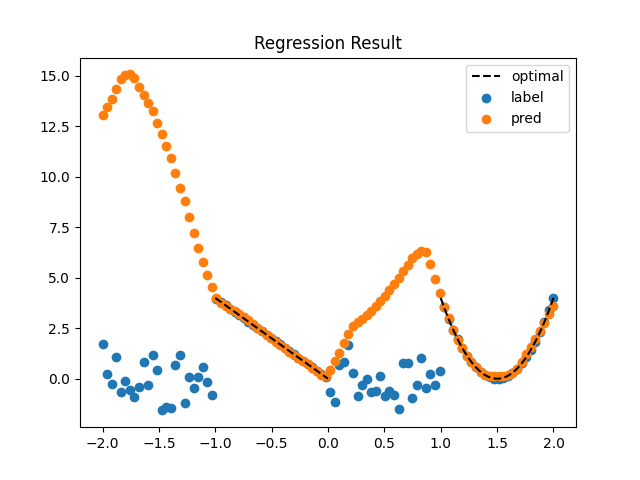

# Conditional Loss Test

## Purpose
- Purpose of this repository is to check whether conditional loss according to input values is possible in PyTorch model. 
- In this project, I want to know whether given random float in ```[-2.0, 2.0]``` is in ```[-1.0, 0.0] + [1.0, 2.0]``` or not. _(Classification)_
  - 
- Furthermore, if the given random is in the range, I want to map it to following _(Regression)_: 
  - if ```x``` is in ```[-1.0, 0.0]```, ```y = -4.0 * x```
  - else if ```x``` is in ```[1.0, 2.0]```, ```y = 16.0 * ((x - 1.5) ** 2)```
  - otherwise, I don't care. 
  - 
- To achieve the goal, my model will be trained to act like below.
  - Input (2 nodes)
    - ```x```: random float in ```[-2.0, 2.0]```
    - ```x ** 2```: square of the random float
  - Output (2 nodes)
    - ```y_cls```: probability of ```x``` in ```[-1.0, 0.0] + [1.0, 2.0]```
    - ```y_reg```: regression of ```y``` value by value of ```x``` 
      - ```x``` in ```[-2.0, -1.0)```: any values (no training)
      - ```x``` in ```[-1.0, 0.0]```: ```y_reg = -4.0 * x```
      - ```x``` in ```(0.0, 1.0)```: any values (no training)
      - ```x``` in ```[1.0, 2.0]```: ```y_reg = 16.0 * ((x - 1.5) ** 2)```

## Results
- I run two times with normal loss function and my custom conditional loss function. 
  - normal loss: combination of ```BCELoss()``` and ```MSELoss()```
  - conditional loss: based on ```BCELoss()``` and:
    - add ```MSELoss()``` if value of ```x``` is in my interesting range ```[-1.0, 0.0] + [1.0, 2.0]```. 
    - don't add ```MSELoss()``` and set regression loss to zero. 
- Results of two training and testing is shown below: 
  - Classification
    - normal loss
      - 
    - conditional loss
      - 
    - In two cases, two models are well trained as I want!
  - Regression
    - normal loss
      - 
    - conditional loss
      - 
    - Model with normal loss was trained to noisy trash data where ```x``` in ```[-2.0, -1.0) + (0.0, 1.0)```, so near ```x = -1.0```, some datas are quite far from ground truth. 
    - However, model with conditional loss wasn't trained from noisy trash data. So, I could get accurate regression in my interesting range. Furthermore, the model estimated regression even outside the training range. 
- You can see more details in [examples](examples) directory. 

## Usage
### Install packages
- Type ```pip3 install -r requirements.txt``` at root directory. 

### Train
- First, open ```train.py``` and set your configurations. 
- Type ```python3 train.py``` at root directory. 
- _(If you want to run it as background process, type ```nohup python3 train.py > [sometrainname].log 2> [sometrainname].err &```)_
- Type ```tensorboard --logdir=runs``` to see model structure and training status. You can see them by accessing <http://localhost:6006/>. 
- _(If you want to share them with others, type ```tensorboard dev upload --logdir=runs``` and follow the instructions. You can get a sharable URL. )_
- After the process, check output folder. Followings are examples of training results. 
  - Output directory
    - 
  - readme.txt
    - ```=== DATA ===
      Train data count 1000
      Val data count 100

      === TRAINING ===
      Shuffle: True
      # of workers: 8
      Drop last: False
      Batch size: 32
      Max epochs: 400
      Initial lr: 0.001
      Weight decay: 5e-05
      Lr drop milestones: [250, 350]
      Validation step: 10
      Save weights step: 100
      Use conditional(custom) loss: True
      Save path: /home/namsaeng/git/pytorch-custom-relu/train-21-08-03-19-40-11
      ```
  - loss graphs
    - 
    - 
    - 
  - loss csvs
    - [loss-train](examples/train-conditional-loss/loss-train.csv)
    - [loss-val](examples/train-conditional-loss/loss-val.csv)
  - result images by tensorboard
    - 

### Test
- First, open ```test.py``` and set your configurations. 
- Type ```python3 test.py``` at root directory. 
- _(If you want to run it as background process, type ```nohup python3 test.py > [sometestname].log 2> [sometestname].err &```)_
- Type ```tensorboard --logdir=runs``` to see model structure and training status. You can see them by accessing <http://localhost:6006/>. 
- _(If you want to share them with others, type ```tensorboard dev upload --logdir=runs``` and follow the instructions. You can get a sharable URL. )_
- After the process, check output folder. Followings are examples of training results. 
  - Output directory
    - 
  - readme.txt
    - ```=== TEST ===
      Test data count 100
      Is pt file (otherwise, weight) False
      Model path /home/namsaeng/git/pytorch-custom-relu/train-21-08-03-19-40-11/final_weights
      Use conditional(custom) loss: True
      Save at /home/namsaeng/git/pytorch-custom-relu/test-21-08-03-19-49-40
      ```
  - loss csv
    - [loss-test](examples/test-conditional-loss/loss-test.csv)
  - result images
    - 
    - 
  - result images by tensorboard
    - 

## Codes
### [dataset.py](dataset.py)
- Define dataset for this repository. 
- Dataset
  - ```x```: ```torch.Tensor``` of ```(item_cnt, 2)``` including random float and its square value. 
  - ```y_cls```: ```torch.Tensor``` of ```(item_cnt, 1)```
    - ```1.0``` for ```x``` in ```[-1.0, 0.0] + [1.0, 2.0]```
    - ```0.0``` for other cases
  - ```y_reg```: ```torch.Tensor``` of ```(item_cnt, 1)```
    - ```-4.0 * x``` for ```x``` in ```[-1.0, 0.0]```
    - ```16.0 * ((x - 1.5) ** 2)``` for ```x``` in ```[1.0, 2.0]```
    - ```randn()``` for other cases (trash data)

### [model.py](model.py)
- Define model for this repository. 
- 
- Layers
  - Common Layers
    - ```Input```: ```(batch_size, 2)```
    - ```Linear```: ```(2, 8)```
    - ```ReLU```
    - ```Linear```: ```(8, 16)```
    - ```ReLU```
    - ```Linear```: ```(16, 16)```
    - ```ReLU```
    - ```Linear```: ```(16, 8)```
    - ```ReLU```
  - Classification Layers
    - ```Linear```: ```(8, 4)```
    - ```ReLU```
    - ```Linear```: ```(4, 1)```
    - ```Sigmoid```
  - Regression Layers
    - ```Linear```: ```(8, 4)```
    - ```ReLU```
    - ```Linear```: ```(4, 1)```

### [loss.py](loss.py)
- Define losses for this repository. 
- Losses
  - ```get_loss()```
    - normal ```BCELoss() + MSELoss()```
    - For ```x``` in ```[-2.0, -1.0) + (0.0, 1.0)```, model don't have to be trained by regression labels so regression loss should be zero, but in this case, regression loss is not zero. 
  - ```get_conditional_loss()```
    - my custom loss
    - Is auto_grad available for this loss? (purpose of this repository)
    - For ```x``` in ```[-2.0, -1.0) + (0.0, 1.0)```, regression loss is set to zero. 

### [train.py](train.py)
- Define train process for this repository. 
- You can change configs as you want. 

### [test.py](train.py)
- Define test process for this repository. 
- You can change configs as you want. 

## To Do
- [x] Tensorboard (model visualization, checking training status)
- [ ] Use tensorboard to find optimal hyperparameters
